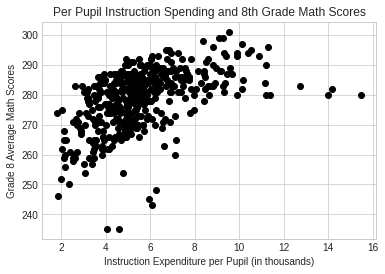
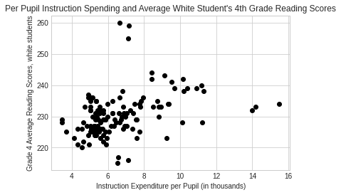
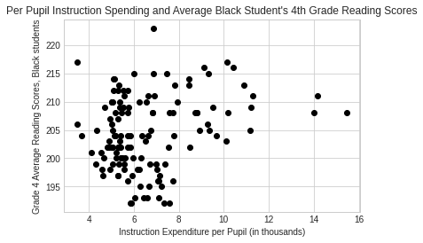
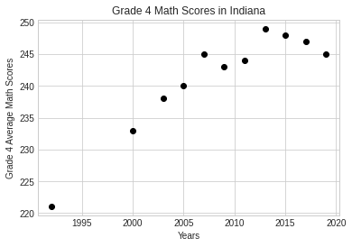

# Examination of State Revenue and Expenditure on Public Education Learning Outcomes in the US

### This repository was created for the DS 201 Final Project.

##### Table of Contents  
[Introduction: Public Education in the US](https://github.com/carolineburns3/finalproject/blob/main/README.md#introduction-public-education-in-the-us) 

[Business Understanding](https://github.com/carolineburns3/finalproject/blob/main/README.md#business-understanding)

[Data Understanding](https://github.com/carolineburns3/finalproject/blob/main/README.md#data-understanding)

[Exploratory Data Analysis](https://github.com/carolineburns3/finalproject/blob/main/README.md#exploratory-data-analysis) 

[Deployment](https://github.com/carolineburns3/finalproject/blob/main/README.md#deployment)

[Run in Colab](https://github.com/carolineburns3/finalproject/blob/main/README.md#run-notebook-in-colab)

[YouTub Video Link](https://github.com/carolineburns3/finalproject/blob/main/README.md#youtube-video-link)

[Sources](https://github.com/carolineburns3/finalproject/blob/main/README.md#sources)
<a name="headers"/>

# Introduction: Public Education in the US
The data set being used was found on Kaggle at this [link](https://www.kaggle.com/noriuk/us-education-datasets-unification-project).

Public education across the United States is largely controlled by local and state governments. Revenue for schools varies across states and localities. For example, in 2017-18, 35 percent of Pennsylvania's revenue came from the state government and 60 percent from local property taxes (AFR Data: Summary-Level). This is a similar trend across states, with some states having more state revenue than local. 

We are looking to explore how public school revenue and expenditure impacts learning outcomes, specifically math and reading standarized test scores. Using the data set from [Kaggle](https://www.kaggle.com/noriuk/us-education-datasets-unification-project) we are able to explore this across states and time.

# Objective

The goal of this project is to determind if there is a positive correlation between different types of state and local revenues, and the academic performance of a student, denoted in this case by math and reading standarized scores. 

A machine learning model was also created using variables such as State, Expenditure per Student, Total Revenue, Instruction Expenditure and Support Services Expenditure to predict Grade 4 Reading scores. 

# Business Understanding
### Funding and Achievement Gaps

Across the nation, there is a history of drastic differences in revenue and expenditure between and within states. In 2011-12, the local and state governments of the wealthiest, top 25 percent of public schools in the nation spent $1,500 more per student, on average, than the amount that the poorest, bottom 25 percent did (Barshay, 2020). This is a racialized issue as well. Black students are more often attending poorer schools with resulting lower achievement levels. Despite the end of legal segregation, minorities in the US still have largely separate and unequal education. While Black and Hispanic students make up 15.5 and 25.4 percent of the US population, 44.1 and 56.7 percent, respectively, attend schools where half of the student body is the same race or ethnicity (Geiger, 2017).

Property taxes have an effect on this differential spending by public schools. Segregated towns and cities mean that different locales will be able to produce more or less revenue depending on the number of businesses, homeowners, and other landowners that are paying property taxes (Turner et al., 2016). Simply put, property values vary from place to place, and higher value property indicates a higher property tax revenue. Some states will send more money to less affluent schools but it doesn't always mitigate the effects (Turner et al., 2016). 

The Nation's Report Card indicates that there are math and reading achievement gaps between students who qualify for free or reduced lunch and those who don't (NAEP). This qualification is a good indication of socioeconmic class. There is also achievement gaps between white and Black students. Public school revenue and expenditure may be a key variable in reducing these achievement gaps. 

### What can governments do?

In 1968, a lawsuit against a school district for differential funding amongst the state went to the Supreme Court. Those who filed the suit argued that the funding system was unequal. The Supreme Court ruled that because education is not a guaranteed right under the US Constitution there are no rights being violated (Martin et al., 2018). Therefore, it is largely a state and local government issue. In turn, there is a variance in how much states spend per student. In New York, for example, spends about $23.3 thousand per student, while Florida spends $9.6 thousand (Hanson, 2021). Policy solutions would have most direct impact if implemented at the state or local level due to the majority of funds coming from those governments. 

# Data Understanding
According to Roy Garrad (2019), the dataset we are using contains information related to student enrollment across the entire United States, separated by state. Data is collected from the United States Census Bureau, the National Center for Education Statistics (NCES), and the Nations Report card and runs from the year 1992 to 2019. It is focused on individual grades and further separated by ethnicity and sex but also specifically records the average math and reading scores for grades 4 and 8. The other part of the set records financial data of the states during this time. This includes state revenue, separated by types of revenue, and expenditures, separated by where the expense is coming from. The enrollment and diversity data is collected from the NCES, the financial data is collected from the U.S Census Bureau, and the Academic achievement data is collected from the Nations Report Card.

The data itself is sorted into a table with columns indicating the data it represents and rows showing what state and year the data is recorded in.

There are small issues to note when dealing with this data set. First, it is important to note that Garrad (2019) explained that the data recorded for ENROLL is from the U.S Census Bureau while the A_A_A (records the same data as ENROLL) is from the NCES data. This will cause some variability in the outcome depending what variable is used. Additionally, the NCES only begins to record gender beginning in 2009. This is more than enough years of data to make accurate models and assumptions based on the data presented. Lastly, the test score data is incomplete and is only available for certain years.
 
| Variable                     | Data type | Description                                                                                                                                                                                                                                                                                                               | Units                |
| ---------------------------- | --------- | ------------------------------------------------------------------------------------------------------------------------------------------------------------------------------------------------------------------------------------------------------------------------------------------------------------------------- | -------------------- |
| PRIMARY_KEY                  | Nominal   | A combination of the year and state name                                                                                                                                                                                                                                                                                  | NA                   |
| STATE                        | Nominal   | Year in which the data is collected                                                                                                                                                                                                                                                                                       | NA                   |
| YEAR                         | Nominal   | State in which the data is collected                                                                                                                                                                                                                                                                                      | NA                   |
| ENROLL                       | Ratio     | The U.S. Census Bureau's count for students in the state                                                                                                                                                                                                                                                                  | Whole Numbers        |
| TOTAL_REVENUE                | Ratio     | The total amount of revenue for the state                                                                                                                                                                                                                                                                                 | Thousands of Dollars |
| FEDERAL_REVENUE              | Ratio     | The total amount of federal revenue for the state                                                                                                                                                                                                                                                                         | Thousands of Dollars |
| STATE_REVENUE                | Ratio     | The total amount of state revenue for the state                                                                                                                                                                                                                                                                           | Thousands of Dollars |
| LOCAL_REVENUE                | Ratio     | The total amount of local revenue for the state                                                                                                                                                                                                                                                                           | Thousands of Dollars |
| TOTAL_EXPENDITURE            | Ratio     | The total expenditure for the state                                                                                                                                                                                                                                                                                       | Thousands of Dollars |
| INSTRUCTION_EXPENDITURE      | Ratio     | The instruction expenditure for the state                                                                                                                                                                                                                                                                                 | Thousands of Dollars |
| SUPPORT_SERVICES_EXPENDITURE | Ratio     | The support services expenditure for the state                                                                                                                                                                                                                                                                            | Thousands of Dollars |
| OTHER_EXPENDITURE            | Ratio     | The expenditure used for other smaller expensesfor the state                                                                                                                                                                                                                                                              | Thousands of Dollars |
| CAPITAL_OUTLAY_EXPENDITURE   | Ratio     | The capital outlay expenditure for the state                                                                                                                                                                                                                                                                              | Thousands of Dollars |
| A_A_A                        | Ratio     | Total number of students in the state                                                                                                                                                                                                                                                                                     | Whole Numbers        |
| G_A_A                        | Ratio     | Total number of students in the indicated grade (G = G01-G12 (grades 1 to 12), PK (Pre-kindergarten),  KG (kindergarten))                                                                                                                                                                                                 | Whole Numbers        |
| G_E_S                        | Ratio     | Total number of students in the indicated grade with the indicated ethnicity and sex (G = Grade; E = AM (American Indian or Alaska Native), AS (Asian), HI (Hispanic/Latino), BL (Black or African American), WH (White), HP (Hawaiian Native/Pacific Islander), and TR (Two or More Races); S = M (Male) and F (Female)) | Whole Numbers        |
| G_E_S_READING                | Ratio     | Average score of students on the Reading test in the indicated grade with the indicated ethnicity and sex (G = Grade; E = Ethnicity (A = all); S = Sex (A = all))                                                                                                                                                         | Ratio                |
| G_E_S_MATHEMATICS            | Ratio     | Average score of students on the Mathematics test in the indicated grade with the indicated ethnicity and sex (G = Grade; E = Ethnicity (A = all); S = Sex (A = all))                                                                                                                                                     | Ratio                |

# Exploratory Data Analysis

## Spending per Pupil in Each State

First, we want to explore how much states spend per pupil. 

New York, Vermont, and New Jersey have spent the most money per pupil on average. Utah, Idaho, and Arizona have spent on average the least money per pupil. A big takeaway here is that states spend different amounts on education per pupil.

## Total Revenue per State Over Time

We can see that California, New York, and Texas have the highest revenue by a notable margin, while the remaining states are more closely clustered together. It makes sense that New York has the highest revenue and also spends the most money per pupil as well. 

## Expenditure, Race, and Standardized Test Scores

Next, we want to explore relationships between expenditure, race, and standardized test scores. First we look into relationships between per student expenditure and all students average test scores.

In all four of these plots, we can see that the Northeast, on average, outspends on students and also tends to have the highest test scores. The Midwest appears to spend the second most on average. Some interesting features to these plots are the outliers coming from Southern state data points. Even though these states are spending a large amount of money per pupil, the standardized test scores are surprisingly low. 

In order to explore the relationship between types of expenditure and test score outcomes we can look at a scatter plot of instruction expenditure and standardized test scores. Instruction expenditure is state's spending on things specifically related to instruction of students. Perhaps targeted expenditure to instruction could have more of an impact on standardized test results. 

There is a positive relationship between per pupil instruction expenditure and 8th grade math scores. This indicates that the more money spent on instruction, the higher test scores tend to be, however, this is not a causal relationship.

There is a positive relationship between both white and Black students 4th grade reading scores and per pupil instruction expenditure. Black student's scores and instruction expenditure are not as strongly correlated as for students overall and white students. 

We noticed a difference in these plots in the average scores of white and Black students so here we conducted a t-test to further explore the averages of white and Black students reading scores. We found that Black students average 4th grade reading score is significantly lower that white students average score. White students on average score 230.37 while Black students score 204.52 on average. This is important for states to keep in mind. 

We wanted to explore some potential solutions to funding and expenditure inequities. Since each state fund and spend differently, we wanted to look into states that may have better or worse policy. We explored Indiana's test scores in order to see if their policy change may impact scores. In 2008, the state of Indiana passed a bill that would set tax rates and ceilings on local local property taxes for education. They then increased state sales and use taxes in order to make up for this loss in local tax revenue.

We see an increase in test scores after 2008, so Indiana's changed tax policy may be a potential solution. This type of policy works to eliminate disparities in revenue within each school district. There is not a lot of data for just Indiana though, so this might be better to explore from within the state: do districts that benefited the most from this policy perform better?

We decided to look more between states. Some states have more funding disparities than others. Alaska allocates the highest percentage of funding to districts with the highest poverty levels, while Nevada's low poverty districts receive more funding than their high poverty districts (Leins 2020). These differences in fundings and expenditures could impact the average scores of students in these states. Since we don't have socioeconomic class data, we use race to look at potential differences. As we know from background research, Black students are more likely to attend low povery schools. The average reading score for Black students in Nevada is significantly less than in Alaska. Scores are 201.4 and 207.5 for Black students in Nevada and Alaska, respectively. This result may indicate that Alaska's more equitable funding (with higher poverty districts getting more money) may impact student outcomes (standardized test scores). White student's scores are not significantly different between Nevada and Alaska. The scores are 226.8 and 225.5 for white students in Nevada and Alaska, respectively. This may be because Alaska's funding choices are more designed to improve underserved school districts.

# Deployment
The visuals created in the exploratory data analysis section shows that there is a positive relationship between the total expenditure per pupil and grade 4 average math scores. In addition to this, states such as New Jersey, Vermont and New York have very high spending per pupil. Looking at the plot of grade 4 math scores for each state, we see that, northeast states such as New Jersey and Vermont have high scores. This implies that, the total expenditure provided by the state, may have an influence on the performacnce of students in institutions found in that state.

The scatter plot of instruction expenditure with grade 4 math scores shows a weak positive realtionship. However, looking at the bar plots of states with high instruction expenditure, we see New York and New Jersey having relatively high instruction expenditure as compared to other states. New Jersey for example, had high grade 4 scores and total expenditure compared to other states. This illustrates that, state expenditure may have a strong influnce on education. This validates our hypothesis.

Additionally, since states spend education money differently, we wanted to look at states spending habits compared to their test score outcomes. Comparing Alaska to Nevada allowed us to look at how Alaska's more equitable spending policy may impact outcomes. Nevada spends much more on low-poverty schools, whereas Alaska spends more on high-poverty schools. Since we don't have socioeconomic status data, we decided to look at Black and white students scores in each state. From our background research, we know that Black students are more likely to attend underresourced schools. Due to segregation, Black students are also more likely to be attending schools that are predominantly students of color. The average 4th grade reading score of Black students in Alaska is significantly higher than in Nevada. Therefore, there may be a relationship between targeted funding towards schools with higher population of Black students or schools with less revenue and student outcomes. Policymakers should further explore different states funding policies to determine if allocating more money to high-poverty schools, the way Alaska does, can impact student outcomes.

# Future Directions

Most importantly, states should become more vigilant with data collection and analysis. Education funding inequity and outcome disparities are pressing issues to society. With most of the power in state and local hands, it would be in their best interest to collect relevant data that would make it easier to explore this issue. We noticed in our research that even with multiple data sources, a lot of information was still missing. This data should be collected more often and analyzed each year to explore potential solutions to the problem.

# Run Notebook in Colab

Click the link below to run our notebook in Colab. 

[Run in Colab](https://colab.research.google.com/drive/1heAQwYFqFyAxDhEHSd7bLvPpsqxbSfAO?usp=sharing)

# YouTube Video Link

Check out our walkthrough video [here](https://github.com/carolineburns3/finalproject/blob/main/README.md#exploratory-data-analysis)

Watch our slides presentation [here](https://github.com/carolineburns3/finalproject/blob/main/README.md#exploratory-data-analysis)

# Sources:

AFR Data: Summary-Level. Pennsylvania Department of Education. (n.d.). Retrieved December 7, 2021, from https://www.education.pa.gov/Teachers%20-%20Administrators/School%20Finances/Finances/AFR%20Data%20Summary/Pages/AFR-Data-Summary-Level.aspx. 

Barshay, J. (2020, June 29). A decade of research on the rich-poor divide in education. The Hechinger Report. Retrieved December 7, 2021, from https://hechingerreport.org/a-decade-of-research-on-the-rich-poor-divide-in-education/. 

Geiger, A. W. (2017, October). Many minority students go to schools where at least half of their peers are their race or ethnicity. Pew Research Center. Retrieved December 7, 2021, from https://www.pewresearch.org/fact-tank/2017/10/25/many-minority-students-go-to-schools-where-at-least-half-of-their-peers-are-their-race-or-ethnicity/. 

Hanson, M. (2021, August 2). U.S. Public Education Spending Statistics. Education Data Initiative. Retrieved December 7, 2021, from https://educationdata.org/public-education-spending-statistics. 

Leins, C. (2020, January 21). States With the Most Equitable School Funding. US News. Retrieved December 13, 2021, from https://www.usnews.com/news/best-states/articles/2020-01-21/states-with-the-most-equitable-school-funding. 

Martin, C., Boser, U., &amp; Baffour, P. (2018, November 13). A Quality Approach to School Funding. Center for American Progress. Retrieved December 7, 2021, from https://www.americanprogress.org/article/quality-approach-school-funding/. 

NAEP. (n.d.). Achievement Gaps Dashboard. The Nation's Report Card. Retrieved December 7, 2021, from https://www.nationsreportcard.gov/dashboards/achievement_gaps.aspx. 

National Conference of State Legislatures. (n.d.). Frequently Asked Questions on the Property Tax. National Conference of State Legislatures. Retrieved December 10, 2021, from https://www.ncsl.org/research/education/funding-approaches-the-property-tax-and-public-ed.aspx. 

Turner, C., Khrais, R., Lloyd, T., Olgin, A., Isensee, L., Vevea, B., &amp; Carsen, D. (2016, April 18). Why America's Schools Have A Money Problem. NPR. Retrieved December 7, 2021, from https://www.npr.org/2016/04/18/474256366/why-americas-schools-have-a-money-problem. 

