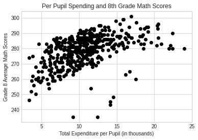
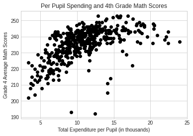
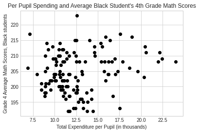

# finalproject

##### Table of Contents  
[Introduction: Public Education in the US](https://github.com/carolineburns3/finalproject/blob/main/README.md#introduction-public-education-in-the-us) 

[Data Understanding](https://github.com/carolineburns3/finalproject/blob/main/README.md#data-understanding)
 
[Business Understanding](https://github.com/carolineburns3/finalproject/blob/main/README.md#business-understanding)

[Exploratory Data Analysis](https://github.com/carolineburns3/finalproject/blob/main/README.md#exploratory-data-analysis) 

[Sources](#Sources)
<a name="headers"/>

# Introduction: Public Education in the US
The data set being used was found on Kaggle at this link: https://www.kaggle.com/noriuk/us-education-datasets-unification-project

Public education across the United States is largely controlled by local and state governments. Revenue for schools varies across states and localities. For example, in 2017-18, 35 percent of Pennsylvania's revenue came from the state government and 60 percent from local property taxes (AFR Data: Summary-Level). This is a similar trend across states, with some states having more state revenue than local. 

We are looking to explore how public school revenue and expenditure impacts learning outcomes, specifically math and reading standarized test scores. Using the data set from [Kaggle](https://www.kaggle.com/noriuk/us-education-datasets-unification-project) we are able to explore this across states and time.

# Business Understanding
### Funding and Achievement Gaps

Across the nation, there is a history of drastic differences in revenue and expenditure between and within states. In 2011-12, the local and state governments of the wealthiest, top 25 percent of public schools in the nation spent $1,500 more per student, on average, than the amount that the poorest, bottom 25 percent did (Barshay, 2020). This is a racialized issue as well. Black students are more often attending poorer schools with resulting lower achievement levels. Despite the end of legal segregation, minorities in the US still have largely separate and unequal education. While Black and Hispanic students make up 15.5 and 25.4 percent of the US population, 44.1 and 56.7 percent, respectively, attend schools where half of the student body is the same race or ethnicity (Geiger, 2017).

Property taxes have an effect on this differential spending by public schools. Segregated towns and cities mean that different locales will be able to produce more or less revenue depending on the number of businesses, homeowners, and other landowners that are paying property taxes (Turner et al., 2016). Simply put, property values vary from place to place, and higher value property indicates a higher property tax revenue. Some states will send more money to less affluent schools but it doesn't always mitigate the effects (Turner et al., 2016). 

The Nation's Report Card indicates that there are math and reading achievement gaps between students who qualify for free or reduced lunch and those who don't (NAEP). This qualification is a good indication of socioeconmic class. There is also achievement gaps between white and Black students. Public school revenue and expenditure may be a key variable in reducing these achievement gaps. 

### What can governments do?

In 1968, a lawsuit against a school district for differential funding amongst the state went to the Supreme Court. Those who filed the suit argued that the funding system was unequal. The Supreme Court ruled that because education is not a guaranteed right under the US Constitution there are no rights being violated (Martin et al., 2018). Therefore, it is largely a state and local government issue. In turn, there is a variance in how much states spend per student. In New York, for example, spends about $23.3 thousand per student, while Florida spends $9.6 thousand (Hanson, 2021). Policy solutions would have most direct impact if implemented at the state or local level due to the majority of funds coming from those governments. 

 # Data Understanding

 According to Roy Garrad (2019), the dataset we are using contains information related to student enrollment across the entire United States. Data is collected from the United States Census Bureau as well as the National Center for Education Statistics (NCES) and runs from the year 1992 to 2019. The data collected is focused on individual grades and further separated by ethnicity and sex. It also specifically records the average math and reading scores for grades 4 and 8. 

The data is sorted into a table with columns indicating the data it represents and rows showing what state and year the data is recorded in. 

It is important to note that Garrad (2021) explained that the data recorded for ENROLL is from the U.S Census Bureau while the A_A_A (records  the same data as ENROLL) is from the NCES data. This will cause some variability in the outcome depending what variable is used.

# Exploratory Data Analysis

 # Sources:

AFR Data: Summary-Level. Pennsylvania Department of Education. (n.d.). Retrieved December 7, 2021, from https://www.education.pa.gov/Teachers%20-%20Administrators/School%20Finances/Finances/AFR%20Data%20Summary/Pages/AFR-Data-Summary-Level.aspx. 

Barshay, J. (2020, June 29). A decade of research on the rich-poor divide in education. The Hechinger Report. Retrieved December 7, 2021, from https://hechingerreport.org/a-decade-of-research-on-the-rich-poor-divide-in-education/. 

Geiger, A. W. (2017, October). Many minority students go to schools where at least half of their peers are their race or ethnicity. Pew Research Center. Retrieved December 7, 2021, from https://www.pewresearch.org/fact-tank/2017/10/25/many-minority-students-go-to-schools-where-at-least-half-of-their-peers-are-their-race-or-ethnicity/. 

Hanson, M. (2021, August 2). U.S. Public Education Spending Statistics. Education Data Initiative. Retrieved December 7, 2021, from https://educationdata.org/public-education-spending-statistics. 

Leins, C. (2020, January 21). States With the Most Equitable School Funding. US News. Retrieved December 13, 2021, from https://www.usnews.com/news/best-states/articles/2020-01-21/states-with-the-most-equitable-school-funding. 

Martin, C., Boser, U., &amp; Baffour, P. (2018, November 13). A Quality Approach to School Funding. Center for American Progress. Retrieved December 7, 2021, from https://www.americanprogress.org/article/quality-approach-school-funding/. 

NAEP. (n.d.). Achievement Gaps Dashboard. The Nation's Report Card. Retrieved December 7, 2021, from https://www.nationsreportcard.gov/dashboards/achievement_gaps.aspx. 

National Conference of State Legislatures. (n.d.). Frequently Asked Questions on the Property Tax. National Conference of State Legislatures. Retrieved December 10, 2021, from https://www.ncsl.org/research/education/funding-approaches-the-property-tax-and-public-ed.aspx. 

Turner, C., Khrais, R., Lloyd, T., Olgin, A., Isensee, L., Vevea, B., &amp; Carsen, D. (2016, April 18). Why America's Schools Have A Money Problem. NPR. Retrieved December 7, 2021, from https://www.npr.org/2016/04/18/474256366/why-americas-schools-have-a-money-problem. 

